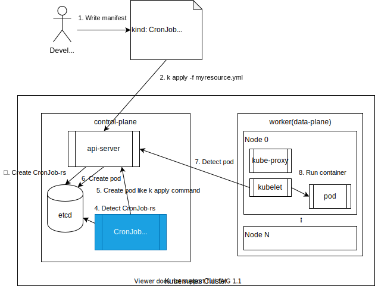

# controller-k8s-cronjob   


[](https://goreportcard.com/report/github.com/transnano/controller-k8s-cronjob)

See the [Tutorial: Building CronJob - The Kubebuilder Book](https://book.kubebuilder.io/cronjob-tutorial/cronjob-tutorial.html) documentation.

## Overview



## Develop

### Scaffolding Out Our Project

program     | version
----------- | ------:
go          |  1.15.1
kubebuilder |   2.3.1

```sh
$ go version
$ kubebuilder version
```

<summary>Result</summary>
<details>

```sh
$ go version
go version go1.15.1 linux/amd64
$ kubebuilder version
Version: version.Version{KubeBuilderVersion:"2.3.1", KubernetesVendor:"1.16.4", GitCommit:"8b53abeb4280186e494b726edf8f54ca7aa64a49", BuildDate:"2020-03-26T16:42:00Z", GoOs:"unknown", GoArch:"unknown"}
```
</details>

```sh
$ go mod init github.com/transnano/controller-k8s-cronjob
$ kubebuilder init --domain transnano.net --license apache2 --owner "Transnano"
```

<summary>Result</summary>
<details>

```sh
$ go mod init github.com/transnano/controller-k8s-cronjob
go: creating new go.mod: module github.com/transnano/controller-k8s-cronjob
$ kubebuilder init --domain transnano.net --license apache2 --owner "Transnano"Writing scaffold for you to edit...
Get controller runtime:
$ go get sigs.k8s.io/controller-runtime@v0.5.0
go: downloading sigs.k8s.io/controller-runtime v0.5.0
go: downloading k8s.io/apimachinery v0.17.2
go: downloading k8s.io/client-go v0.17.2
go: downloading golang.org/x/time v0.0.0-20190308202827-9d24e82272b4
go: downloading github.com/gogo/protobuf v1.2.2-0.20190723190241-65acae22fc9d
go: downloading github.com/evanphx/json-patch v4.5.0+incompatible
go: downloading github.com/pkg/errors v0.8.1
go: downloading github.com/google/gofuzz v1.0.0
go: downloading github.com/json-iterator/go v1.1.8
go: downloading github.com/prometheus/client_golang v1.0.0
go: downloading gopkg.in/inf.v0 v0.9.1
go: downloading github.com/modern-go/reflect2 v1.0.1
go: downloading github.com/prometheus/common v0.4.1
go: downloading sigs.k8s.io/yaml v1.1.0
go: downloading github.com/beorn7/perks v1.0.0
go: downloading github.com/modern-go/concurrent v0.0.0-20180306012644-bacd9c7ef1dd
go: downloading gopkg.in/yaml.v2 v2.2.4
go: downloading k8s.io/apiextensions-apiserver v0.17.2
go: downloading k8s.io/utils v0.0.0-20191114184206-e782cd3c129f
go: downloading golang.org/x/sys v0.0.0-20190826190057-c7b8b68b1456
go: downloading gopkg.in/fsnotify.v1 v1.4.7
go: downloading github.com/golang/protobuf v1.3.2
go: downloading github.com/google/go-cmp v0.3.0
go: downloading github.com/google/uuid v1.1.1
go: downloading k8s.io/api v0.17.2
go: downloading k8s.io/klog v1.0.0
go: downloading github.com/prometheus/client_model v0.0.0-20190129233127-fd36f4220a90
go: downloading github.com/imdario/mergo v0.3.6
go: downloading github.com/davecgh/go-spew v1.1.1
go: downloading gomodules.xyz/jsonpatch/v2 v2.0.1
go: downloading github.com/hashicorp/golang-lru v0.5.1
go: downloading golang.org/x/oauth2 v0.0.0-20190604053449-0f29369cfe45
go: downloading github.com/matttproud/golang_protobuf_extensions v1.0.1
go: downloading github.com/prometheus/procfs v0.0.2
go: downloading golang.org/x/net v0.0.0-20191004110552-13f9640d40b9
go: downloading github.com/googleapis/gnostic v0.3.1
go: downloading github.com/go-logr/logr v0.1.0
go: downloading golang.org/x/crypto v0.0.0-20190820162420-60c769a6c586
go: downloading github.com/spf13/pflag v1.0.5
go: downloading github.com/golang/groupcache v0.0.0-20180513044358-24b0969c4cb7
go: downloading google.golang.org/appengine v1.5.0
go: downloading k8s.io/kube-openapi v0.0.0-20191107075043-30be4d16710a
go: downloading golang.org/x/text v0.3.2
Update go.mod:
$ go mod tidy
go: downloading go.uber.org/zap v1.10.0
go: downloading github.com/go-logr/zapr v0.1.0
go: downloading github.com/onsi/ginkgo v1.11.0
go: downloading cloud.google.com/go v0.38.0
go: downloading github.com/stretchr/testify v1.4.0
go: downloading github.com/onsi/gomega v1.8.1
go: downloading gopkg.in/check.v1 v1.0.0-20180628173108-788fd7840127
go: downloading github.com/pmezard/go-difflib v1.0.0
go: downloading github.com/kr/pretty v0.1.0
go: downloading golang.org/x/xerrors v0.0.0-20190717185122-a985d3407aa7
go: downloading github.com/fsnotify/fsnotify v1.4.7
go: downloading go.uber.org/multierr v1.1.0
go: downloading go.uber.org/atomic v1.3.2
go: downloading github.com/hpcloud/tail v1.0.0
go: downloading github.com/kr/text v0.1.0
go: downloading gopkg.in/tomb.v1 v1.0.0-20141024135613-dd632973f1e7
Running make:
$ make
go: creating new go.mod: module tmp
go: downloading sigs.k8s.io/controller-tools v0.2.5
go: found sigs.k8s.io/controller-tools/cmd/controller-gen in sigs.k8s.io/controller-tools v0.2.5
go: downloading k8s.io/apimachinery v0.17.0
go: downloading github.com/spf13/cobra v0.0.5
go: downloading k8s.io/api v0.17.0
go: downloading k8s.io/apiextensions-apiserver v0.17.0
go: downloading github.com/fatih/color v1.7.0
go: downloading gopkg.in/yaml.v3 v3.0.0-20190905181640-827449938966
go: downloading github.com/gobuffalo/flect v0.2.0
go: downloading golang.org/x/tools v0.0.0-20190920225731-5eefd052ad72
go: downloading github.com/inconshreveable/mousetrap v1.0.0
go: downloading github.com/mattn/go-isatty v0.0.8
go: downloading github.com/mattn/go-colorable v0.1.2
/go/bin/controller-gen object:headerFile="hack/boilerplate.go.txt" paths="./..."
go fmt ./...
go vet ./...
go build -o bin/manager main.go
Next: define a resource with:
$ kubebuilder create api
```
</details>

### 

`main.go`でマネージャーを作成しているが、名前空間を指定していないため、すべての名前空間を監視します。

```go
	mgr, err := ctrl.NewManager(ctrl.GetConfigOrDie(), ctrl.Options{
		Scheme:             scheme,
		MetricsBindAddress: metricsAddr,
    Port:               9443,
		// Namespace:          "",
		LeaderElection:     enableLeaderElection,
		LeaderElectionID:   "77aadf3c.transnano.net",
	})
```

Ref: [Every journey needs a start, every program a main - The Kubebuilder Book](https://book.kubebuilder.io/cronjob-tutorial/empty-main.html)

<summary>Result</summary>
<details>

```sh

```
</details>

### Adding a new API

```sh
$ kubebuilder create api --group batch --version v1alpha1 --kind CronJob
```

<summary>Result</summary>
<details>

```sh
$ kubebuilder create api --group batch --version v1alpha1 --kind CronJob
Create Resource [y/n]
y
Create Controller [y/n]
y
Writing scaffold for you to edit...
api/v1alpha1/cronjob_types.go
controllers/cronjob_controller.go
Running make:
$ make
/go/bin/controller-gen object:headerFile="hack/boilerplate.go.txt" paths="./..."
go fmt ./...
go vet ./...
go build -o bin/manager main.go
```
</details>

### Designing an API

```sh
$ vim ./api/v1alpha1/cronjob_types.go
```

<summary>Result</summary>
<details>

```sh

```
</details>

### Implementing a controller

```sh
$ vim ./controllers/cronjob_controller.go
```

<summary>Result</summary>
<details>

```sh

```
</details>

### 

```sh

```

<summary>Result</summary>
<details>

```sh

```
</details>

## Demo

Download [Kustomize(Binaries)](https://kubernetes-sigs.github.io/kustomize/installation/binaries/)

```sh
$ kustomize version
{Version:kustomize/v3.8.2 GitCommit:e2973f6ecc9be6187cfd5ecf5e180f842249b3c6 BuildDate:2020-08-29T17:44:01Z GoOs:linux GoArch:amd64}
```

make

```sh
$ make install
$ make run
$ kubectl apply -f config/samples/
```

```sh
$ kubectl get crd
NAME                                             CREATED AT
...
guestbook2s.webapp.my.domain                     2020-09-07T12:56:01Z
guestbooks.webapp.my.domain                      2020-09-07T12:56:01Z
...
```

```sh
$ kubectl create namespace controller-k8s-cronjob-system
```

or

```sh
$ cat my-namespace.yaml
apiVersion: v1
kind: Namespace
metadata:
  name: controller-k8s-cronjob-system

$ kubectl create -f ./my-namespace.yaml
```

```sh
$ make deploy IMG=transnano/controller-k8s-cronjob:latest
```

```sh
$ kubectl get pods --namespace=controller-k8s-cronjob-system
NAME                                                            READY   STATUS    RESTARTS   AGE
controller-k8s-cronjob-controller-manager-5df9b76756-dsmvc   2/2     Running   0          37s
```

```sh
$ kubectl get svc --namespace=controller-k8s-cronjob-system
NAME                                                           TYPE        CLUSTER-IP   EXTERNAL-IP   PORT(S)    AGE
controller-k8s-cronjob-controller-manager-metrics-service   ClusterIP   10.8.3.65    <none>        8443/TCP   8m45s
```

```sh
$ kubectl get deploy --namespace=controller-k8s-cronjob-system
NAME                                           READY   UP-TO-DATE   AVAILABLE   AGE
controller-k8s-cronjob-controller-manager   1/1     1            1           13m
```

### Extra

```sh
$ kubectl api-resources --namespaced=true
$ kubectl api-resources --namespaced=false
```

```sh
$ kubectl get all
```
